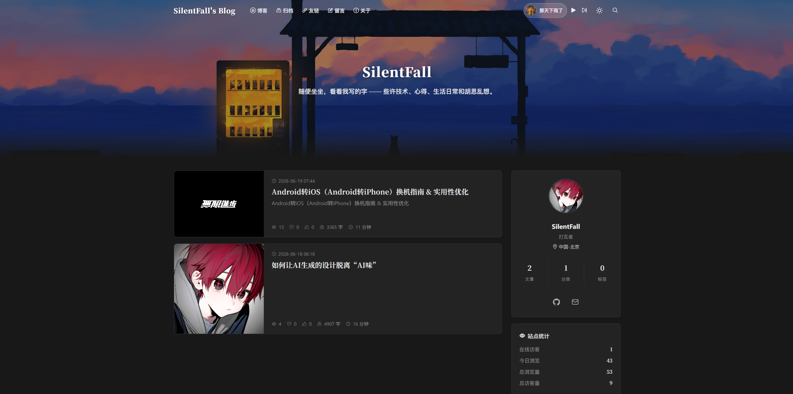
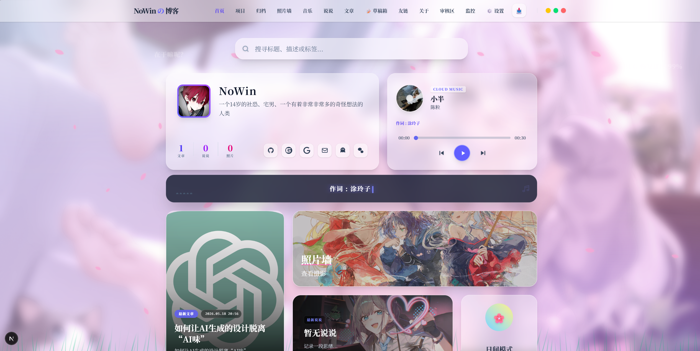
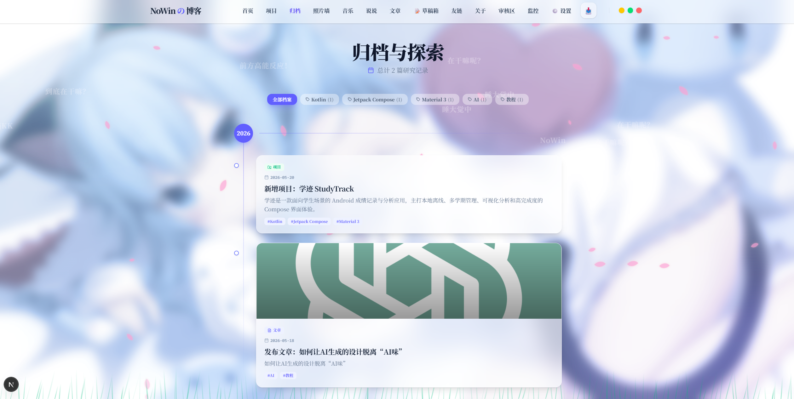

# SilentFall_Blog - 自托管个人博客系统

基于 [XHBlogs](https://github.com/heiehiehi/XinghuisamaBlogs) 二次开发，使用 Next.js 16 + Python FastAPI 构建的高颜值毛玻璃风格个人博客系统。**完全自托管，无需 GitHub/Vercel。**

> 🙏 **致谢**：本项目由 [XHBlogs](https://github.com/heiehiehi/XinghuisamaBlogs) 二改而来，感谢原作者 [heiehiehi](https://github.com/heiehiehi) 的优秀作品。

## 页面预览

<div align="center">
  
  
</div>
<div align="center">
  
</div>

## 核心功能

### 📝 内容管理

- **文章**：Markdown 写作，支持代码高亮（One Dark 主题）、数学公式（KaTeX）、目录导航（TOC）
- **说说**：博主说说（Markdown 文件）+ 访客说说（MongoDB）混合展示，按时间排序
- **关于页面**：后台可视化编辑关于页面内容，一键跳转编辑器
- **操作暂存区**：修改设置 → 暂存到操作队列 → 更新本地 → 同步 Blog（设置页与项目页已支持自动同步，无需手动操作队列）

### 📢 博客公告

- **后台管理**：创建/编辑/删除公告，支持草稿和发布状态切换
- **前台弹窗**：会话级居中弹窗，仅在新标签页首次访问时触发（sessionStorage 控制）
- **多公告堆叠**：多条已发布公告按发布时间降序在同一弹窗内展示
- **溢出滚动**：弹窗最大高度 80vh，超出部分内部滚动

### 💬 评论系统

自建评论系统，数据存储在 MongoDB，支持：
- 昵称 + 邮箱评论（自动生成 Cravatar 头像）
- 评论回复（树状嵌套）
- 评论点赞
- 后台管理面板（审核、隐藏、删除）
- 统计数据（总数、已审核、待审核、已隐藏）
- 发布评论后自动清空输入框（昵称、邮箱、内容）

### ✏️ 访客说说

访客可以在说说页面发布自己的内容，支持：
- 富文本编辑器（Tiptap：加粗、斜体、高亮、下划线、对齐等）
- 填写昵称、邮箱（可选）、内容
- 提交后进入**待审核**状态，前台不显示
- 博主在审核中心统一审核（通过/拒绝/删除）
- 审核通过后在前台说说列表中与博主说说混合展示
- 访客说说带有"访客"标识，与博主说说区分

###  Steam 游戏库

展示博主的 Steam 游戏收藏与通关记录，支持：
- **前端展示**：搜索、分类筛选（所有游戏/已安装/通关留念）、6 列响应式网格、悬停动效、图片容错
- **后台管理**：完整 CRUD（添加/编辑/删除游戏）、封面上传（支持 URL 输入和本地上传）、数据同步
- **游戏状态**：未安装、已安装、已通关、完美通关

### 🎨 主题系统

- 日间/夜间模式切换（**默认日间模式**）
- 主题偏好持久化到 localStorage
- 毛玻璃风格 UI
- 多种背景特效：樱花、萤火虫、弹幕、天气效果、风草等

### 🎵 网易云音乐

- 在后台管理器音乐设置中输入网易云音乐歌曲 ID
- 前台浮动播放器 + 歌词栏
- 支持 APlayer 播放模式

### 🖼️ 图床

- 内置图床上传功能，支持"去不图床"等标准 API 图床
- 支持本地存储模式（图片保存到 `public/uploads/`）
- 支持直接插入图片外链
- 编辑器内拖拽上传

### 🔗 友链系统

- 友链展示页面
- 访客可复制申请格式申请友链
- 后台管理友链列表

### 📊 其他功能

- **照片墙**：图片展示
- **项目展示**：个人项目列表
- **时间线**：建站历程
- **天气组件**：实时天气显示
- **全局工具箱**：计算器等小工具
- **搜索功能**：文章搜索（防抖优化）
- **点击特效**：互动反馈
- **后台监控**：博客运行数据概览
- **审核中心**：统一审核评论与访客说说
- **访问记录**：记录访客访问行为，支持按 IP/页面筛选和去重显示
- **移动端适配**：全面适配手机端，包括响应式布局、触控优化、横向溢出修复等
- **自动同步**：设置页/项目页修改后自动同步到博客，发布文章后自动退出编辑页面
- **API 代理路由**：前端通过 Next.js API Route 代理请求后端，避免跨域问题

## 性能优化

本项目已实施以下性能优化措施：

| 优化类别 | 具体措施 |
|----------|----------|
| 代码分割 | 12+ 个重型组件（粒子特效、弹幕、播放器、轮播等）使用 `next/dynamic` 懒加载 |
| 渲染优化 | `React.memo` 包裹列表项、`requestAnimationFrame` 滚动节流、搜索防抖 |
| 请求优化 | 评论 API 无缓存（实时数据）、天气 API 5 分钟缓存 |
| ISR 增量更新 | 首页/列表页 10 分钟、文章详情 60 秒自动重新生成 |
| 传输优化 | Gzip 压缩、静态资源 1 年强缓存、DNS 预解析 |
| 图片优化 | 文章卡片和评论头像 `loading="lazy"` 懒加载，关键图片显式 `width`/`height` 消除 CLS |
| 按需加载 | KaTeX CSS 仅在文章页加载，highlight.js 按需加载 18 种常用语言 |
| 移动端适配 | 全局 `@media (max-width: 768px)` 响应式修复、触控区域 ≥44px、横向溢出防护、flex 纵向排列 |
| API 代理 | Next.js API Route Handlers 代理后端请求，前端不直接请求 Python 后端，避免跨域 |

## 项目结构

```
SilentFall_Blog/
├── SFBlogs/                  # 博客前端（Next.js 16）
│   ├── app/                  # 页面路由
│   │   ├── about/            # 关于页
│   │   ├── api/              # API 代理层
│   │   │   ├── analytics/    # 访问记录接口
│   │   │   ├── announcements/# 公告接口
│   │   │   ├── comments/     # 评论接口
│   │   │   ├── guest-moments/# 访客说说接口
│   │   │   └── weather/      # 天气接口
│   │   ├── friends/          # 友链
│   │   ├── moments/          # 说说（博主 + 访客混合展示）
│   │   ├── music/            # 音乐
│   │   ├── photowall/        # 照片墙
│   │   ├── posts/            # 文章（列表 + 详情）
│   │   ├── projects/         # 项目
│   │   ├── steam/            # Steam 游戏库
│   │   └── timeline/         # 时间线
│   ├── components/           # UI 组件
│   │   ├── AnnouncementModal.tsx    # 会话级公告弹窗
│   │   ├── DynamicImports.tsx       # 全局重型组件懒加载入口
│   │   ├── HomeDynamicImports.tsx   # 首页重型组件懒加载入口
│   │   ├── DynamicComments.tsx      # 评论组件懒加载入口
│   │   ├── PostsBoard.tsx           # 文章列表（memo 优化）
│   │   ├── Comments.tsx             # 评论系统（memo 优化）
│   │   ├── ClientTOC.tsx            # 目录导航（rAF 节流）
│   │   ├── SearchBar.tsx            # 搜索框（防抖优化）
│   │   ├── VisitorMomentEditor.tsx  # 访客说说富文本编辑器
│   │   ├── ThemeProvider.tsx        # 主题切换（默认日间模式）
│   │   ├── CloudPlayer.tsx          # 网易云音乐播放器
│   │   ├── WeatherWidget.tsx        # 天气组件
│   │   ├── DanmakuBackground.tsx    # 弹幕背景
│   │   ── ...                      # 其他 UI 组件
│   ├── data/                 # 数据文件（友链、图库、项目、游戏库）
│   ├── posts/                # 文章 Markdown 文件
│   ├── moments/              # 博主说说 Markdown 文件
│   ├── siteConfig.ts         # 站点配置
│   ├── deploy.sh             # Linux 服务器一键部署脚本
│   └── next.config.ts        # Next.js 配置（standalone + 压缩 + 缓存头）
│
├── my-blog-manager/          # 后台管理器（Next.js 16 + Python FastAPI）
│   ├── app/                  # 管理页面
│   │   ├── about/            # 关于页面编辑
│   │   ├── admin/            # 管理面板
│   │   │   ├── analytics/    # 运行监控
│   │   │   ├── announcements/# 公告管理
│   │   │   ├── review/       # 审核中心（评论 + 访客说说）
│   │   │   ├── view-records/ # 访问记录管理
│   │   │   └── visitors/     # 访客管理
│   │   ├── api/              # API 代理层
│   │   │   ├── analytics/    # 监控数据接口
│   │   │   ├── comments/     # 评论管理接口
│   │   │   ├── config/       # 配置代理接口
│   │   │   ├── drafts/       # 草稿代理接口
│   │   │   ├── guest-moments/# 访客说说管理接口
│   │   │   ├── music/        # 音乐查询代理接口
│   │   │   ├── sync/         # 同步代理接口
│   │   │   └── view-records/ # 访问记录接口
│   │   ├── editor/           # 文章编辑器
│   │   ├── friends/          # 友链管理
│   │   ├── moments/          # 说说管理
│   │   ├── posts/            # 文章管理
│   │   ├── projects/         # 项目管理
│   │   ├── settings/         # 设置页面（7 个模块）
│   │   ├── steam/            # Steam 游戏库管理
│   │   └── ...               # 其他管理页面
│   ├── components/
│   │   ├── editor/           # 富文本编辑器（Tiptap）
│   │   ├── settings/         # 设置模块（7 个子组件）
│   │   └── ...               # 其他组件
│   ├── context/
│   │   └── OperationContext.tsx  # 操作暂存队列（编辑器等仍使用）
│   ├── cms_core/             # Python 后端核心
│   │   ├── api/              # API 路由
│   │   │   ├── analytics.py      # 监控数据 + 访问记录 API
│   │   │   ├── announcements.py  # 公告 CRUD API
│   │   │   ├── comments.py       # 评论 API
│   │   │   ├── guest_moments.py  # 访客说说 API
│   │   │   ├── config.py         # 配置 API
│   │   │   ├── drafts.py         # 草稿 API
│   │   │   ├── friends.py        # 友链 API
│   │   │   ├── gallery.py        # 图库 API
│   │   │   ├── moments.py        # 说说 API
│   │   │   ├── music.py          # 音乐 API
│   │   │   ├── picbed.py         # 图床 API
│   │   │   ├── projects.py       # 项目 API
│   │   │   ├── steam.py          # Steam 游戏库 API
│   │   │   └── sync.py           # 同步 API
│   │   ├── database.py       # MongoDB 连接模块
│   │   └── main.py           # FastAPI 入口
│   ├── posts/                # 文章 Markdown 文件（与前端同步）
│   ├── moments/              # 博主说说 Markdown 文件（与前端同步）
│   ├── data/                 # 数据存储（友链、图库、项目、游戏库）
│   └── siteConfig.ts         # 管理端站点配置
│
└── Screenshot/               # 页面截图
    ├── 1.png
    ├── 2.png
    └── 3.png
```

## 技术栈

| 层级 | 技术 |
|------|------|
| 前端框架 | Next.js 16（App Router + Turbopack） |
| UI | React 19 + Tailwind CSS 4 + Framer Motion |
| 图标 | Lucide React |
| 富文本编辑 | Tiptap（StarterKit + Highlight + Underline + TextAlign 等） |
| 后端 | Python FastAPI + Uvicorn |
| 数据库 | MongoDB（评论 + 访客说说 + 公告数据） |
| 头像 | Cravatar（Gravatar 国内镜像） |

## 环境要求

- **Node.js** v18+（前端运行与构建）
- **Python** 3.10+（后端 API 服务）
- **MongoDB** 6.0+（评论、访客说说与公告数据存储）
- **npm**（包管理器）

## 快速开始

### 1. 安装依赖

```bash
# 前端依赖
cd SFBlogs
npm install

# 后台管理器依赖
cd my-blog-manager
npm install

# 后端 Python 依赖
pip install fastapi uvicorn python-multipart PyYAML markdown markdownify httpx requests pymongo
```

### 2. 启动 MongoDB

```bash
# Linux
sudo systemctl start mongod

# Windows（安装 MongoDB 后）
net start MongoDB

# macOS
brew services start mongodb-community
```

### 3. 启动服务

**方式一：Linux 服务器一键部署**

```bash
cd SFBlogs
# 首次需要构建
npm run build

# 设置环境变量
export MONGO_URI="mongodb://localhost:27017"
export MONGO_DB_NAME="silentfall_blog"
export CMS_BACKEND_URL="http://127.0.0.1:8765"

# 启动
chmod +x deploy.sh
./deploy.sh
```

**方式二：本地开发调试**

```bash
# 终端1：启动 Python 后端
cd my-blog-manager
python -c "from cms_core.main import app; import uvicorn; uvicorn.run(app, host='0.0.0.0', port=8765)"

# 终端2：启动博客前端
cd SFBlogs
npm run dev

# 终端3：启动后台管理器
cd my-blog-manager
npm run dev
```

### 4. 访问服务

| 服务 | 地址 |
|------|------|
| 博客前端 | http://localhost:3000 |
| 后台管理 | http://localhost:3001 |
| Python 后端 API | http://localhost:8765/api/status |

## 环境变量

| 变量名 | 说明 | 默认值 |
|--------|------|--------|
| `MONGO_URI` | MongoDB 连接地址 | `mongodb://localhost:27017` |
| `MONGO_DB_NAME` | MongoDB 数据库名 | `silentfall_blog` |
| `CMS_BACKEND_URL` | Python 后端地址 | `http://127.0.0.1:8765` |
| `PORT` | 前端端口号 | `3000` |

## 数据存储

| 数据类型 | 存储方式 | 说明 |
|----------|----------|------|
| 博客文章 | Markdown 文件 | `SFBlogs/posts/` 目录 |
| 博主说说 | Markdown 文件 | `SFBlogs/moments/` 目录 |
| 评论 | MongoDB | `comments` 集合 |
| 访客说说 | MongoDB | `guest_moments` 集合 |
| 公告 | MongoDB | `announcements` 集合 |
| 访问记录 | MongoDB | `page_views` 集合 |
| 友链/图库/项目/游戏库 | TypeScript 数据文件 | `data/` 目录 |
| 站点配置 | TypeScript 配置文件 | `siteConfig.ts` |

## 服务器部署（生产环境）

> 📘 **详细部署教程**：如果你使用宝塔面板部署，请阅读 [如何用服务器的宝塔面板将博客项目部署到你的服务器中.md](./如何用服务器的宝塔面板将博客项目部署到你的服务器中.md)，里面有从零开始的超详细图文步骤，适合新手。

### 1. 构建

```bash
cd SFBlogs
npm run build
```

构建产物在 `.next/standalone` 目录下，可直接部署。

### 2. 配置 Nginx 反向代理

```nginx
server {
    listen 80;
    server_name your-domain.com;

    location / {
        proxy_pass http://127.0.0.1:3000;
        proxy_set_header Host $host;
        proxy_set_header X-Real-IP $remote_addr;
    }

    location /api/ {
        proxy_pass http://127.0.0.1:8765/api/;
        proxy_set_header Host $host;
        proxy_set_header X-Real-IP $remote_addr;
    }
}
```

### 3. 使用 systemd 管理服务（推荐）

```ini
# /etc/systemd/system/silentfall-blog-web.service
[Unit]
Description=SilentFall_Blog Frontend
After=network.target

[Service]
WorkingDirectory=/path/to/SFBlogs/.next/standalone
ExecStart=/usr/bin/node server.js
Environment=HOSTNAME=0.0.0.0
Environment=CMS_BACKEND_URL=http://127.0.0.1:8765
Restart=always

[Install]
WantedBy=multi-user.target
```

```ini
# /etc/systemd/system/silentfall-blog-api.service
[Unit]
Description=SilentFall_Blog Backend API
After=network.target mongod.service

[Service]
WorkingDirectory=/path/to/my-blog-manager
ExecStart=/usr/bin/python3 -c "from cms_core.main import app; import uvicorn; uvicorn.run(app, host='0.0.0.0', port=8765)"
Environment=MONGO_URI=mongodb://localhost:27017
Environment=MONGO_DB_NAME=silentfall_blog
Restart=always

[Install]
WantedBy=multi-user.target
```

```bash
sudo systemctl enable silentfall-blog-web silentfall-blog-api
sudo systemctl start silentfall-blog-web silentfall-blog-api
```

## 许可协议

[](https://creativecommons.org/licenses/by-nc/4.0/)

本项目采用 [CC BY-NC 4.0](https://creativecommons.org/licenses/by-nc/4.0/) 许可协议。允许免费学习、分享和二次修改后发布（二次开源发布需提及原作者），但**严禁用于任何商业用途**。
